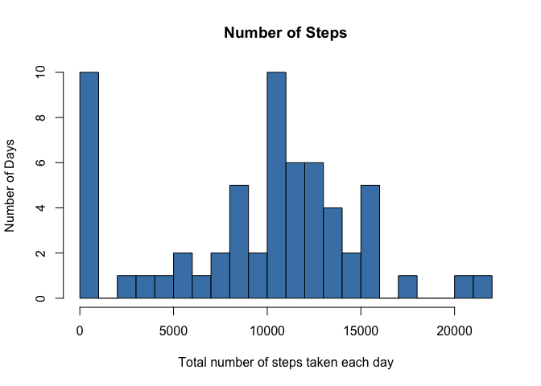
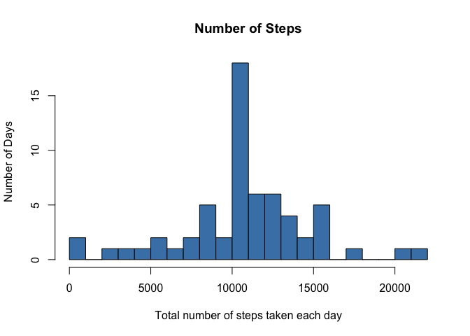
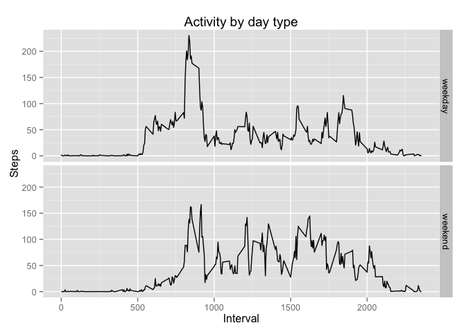

Loading and preprocessing the data
----------------------------------

Show any code that is needed to

1.  Load the data (i.e. read.csv())

2.  Process/transform the data (if necessary) into a format suitable for
    your analysis

<!-- -->

    library(sqldf)

    ## Loading required package: gsubfn
    ## Loading required package: proto

    ## Warning in doTryCatch(return(expr), name, parentenv, handler): unable to load shared object '/Library/Frameworks/R.framework/Resources/modules//R_X11.so':
    ##   dlopen(/Library/Frameworks/R.framework/Resources/modules//R_X11.so, 6): Library not loaded: /usr/X11/lib/libSM.6.dylib
    ##   Referenced from: /Library/Frameworks/R.framework/Resources/modules//R_X11.so
    ##   Reason: image not found

    ## Could not load tcltk.  Will use slower R code instead.
    ## Loading required package: RSQLite
    ## Loading required package: DBI
    ## Loading required package: RSQLite.extfuns

    ## set the working directory
    setwd("/Users/bart/Documents/R/Coursera/Cursus5/RepData_PeerAssessment1")

    ## cleaning variables
    rm(list=ls())

    ## created on non-english system, so setlocale()
    Sys.setlocale("LC_TIME", "C")

    activity <- read.csv("activity.csv", header = T, sep = ",")

What is mean total number of steps taken per day?
-------------------------------------------------

For this part of the assignment, you can ignore the missing values in
the dataset.

1.  Make a histogram of the total number of steps taken each day

2.  Calculate and report the mean and median total number of steps taken
    per day

<!-- -->

    totsteps <- aggregate(x = activity$steps, by = list(activity$date), FUN = "sum", na.rm = T)
    colnames(totsteps) <- c("date", "steps")

    hist(totsteps$steps, breaks = 20, main = "Number of Steps", xlab = "Total number of steps taken each day", ylab = "Number of Days", col = "steelblue")

    mmean <- as.numeric(mean(totsteps$steps))
    mmedian <- as.numeric(median(totsteps$steps))
    mmean

    ## [1] 9354.23

    mmedian

    ## [1] 10395

The mean total number of steps is 9354.2295082, the median is
1.039510\^{4}.

What is the average daily activity pattern?
-------------------------------------------

1.  Make a time series plot (i.e. type = "l") of the 5-minute interval
    (x-axis) and the average number of steps taken, averaged across all
    days (y-axis)

2.  Which 5-minute interval, on average across all the days in the
    dataset, contains the maximum number of steps?

First the time series plot:

    meansteps <- aggregate(x = activity$steps, by = list(activity$interval), FUN = "mean", na.rm = T)
    colnames(meansteps) <- c("interval", "steps")
    # summary(meansteps)

    labels <- c("00:00", "05:00", "10:00", "15:00", "20:00")
    labels.at <- seq(0, 2000, 500)
    with(meansteps, plot(interval, steps, type = "l", xlab = "Time of day", xaxt = "n", ylab = "Number of steps"))
    axis(side = 1, at = labels.at, labels = labels)

Then the interval:

    maxsteps <- which.max(meansteps$steps) 
    maxinterval <- meansteps[maxsteps, "interval"]

The interval with the maximum number of steps is interval 835.

Imputing missing values
-----------------------

Note that there are a number of days/intervals where there are missing
values (coded as NA). The presence of missing days may introduce bias
into some calculations or summaries of the data.

1.  Calculate and report the total number of missing values in the
    dataset (i.e. the total number of rows with NAs)

2.  Devise a strategy for filling in all of the missing values in the
    dataset. The strategy does not need to be sophisticated. For
    example, you could use the mean/median for that day, or the mean for
    that 5-minute interval, etc.

3.  Create a new dataset that is equal to the original dataset but with
    the missing data filled in.

4.  Make a histogram of the total number of steps taken each day and
    Calculate and report the mean and median total number of steps taken
    per day. Do these values differ from the estimates from the first
    part of the assignment? What is the impact of imputing missing data
    on the estimates of the total daily number of steps?

Just keep the measured steps:

    filledsteps <- na.omit(activity)
    # summary(filledsteps)

Use sqldf to construct SQL-like commands. Take the NA's (null in SQL)

    strsql = " select date, interval, steps
                from activity
                where steps is null
                order by date, interval"
    emptysteps <- sqldf(strsql, stringsAsFactors = FALSE)
    # summary(emptysteps)

Can we tell something about the dates without measured steps?

    strsql2 = " select distinct date
                from emptysteps
                order by date"
    emptydays <- sqldf(strsql2, stringsAsFactors = FALSE)
    summary(emptydays)

    ##          date  
    ##  2012-10-01:1  
    ##  2012-10-08:1  
    ##  2012-11-01:1  
    ##  2012-11-04:1  
    ##  2012-11-09:1  
    ##  2012-11-10:1  
    ##  (Other)   :2

For some reason all the records without measured steps are in the same 8
days.

Fill in the empty values with the means for the given interval Do so by
combining the dataframe with the empty steps with the dataframe with the
means, and keep only the calculated steps in a new dataframe.

    join_string <- "select
                  meansteps.steps
                  , emptysteps.date
                  , emptysteps.interval
                  from emptysteps
                    left join meansteps
                    on emptysteps.interval = meansteps.interval"

    joinedsteps <- sqldf(join_string, stringsAsFactors = FALSE)
    # summary(joinedsteps)

    newactivity <- rbind(filledsteps, joinedsteps)
    # summary(newactivity)

Perform the calculations on the new dataset and make a histogram.

    newtotsteps <- aggregate(x = newactivity$steps, by = list(newactivity$date), FUN = "sum", na.rm = T)
    colnames(newtotsteps) <- c("date", "steps")
    # summary(newtotsteps)

    hist(newtotsteps$steps, breaks = 20, main = "Number of Steps", xlab = "Total number of steps taken each day", ylab = "Number of Days", col = "steelblue")

    newmean <- as.numeric(mean(newtotsteps$steps))
    newmedian <- as.numeric(median(newtotsteps$steps))
    newmean

    ## [1] 10766.19

    newmedian

    ## [1] 10766.19

The original mean is 9354.2295082. The new mean is 1.076618910\^{4}.

The original median is 1.039510\^{4}. The new median is
1.076618910\^{4}.

Median and mean are now the same, both have slightly changed.

Using inline r-code creates strange looking numbers, so the r-output
again:

    # original and new mean
    mmean

    ## [1] 9354.23

    newmean

    ## [1] 10766.19

    # original and new median
    mmedian

    ## [1] 10395

    newmedian

    ## [1] 10766.19

Are there differences in activity patterns between weekdays and weekends?
-------------------------------------------------------------------------

For this part the weekdays() function may be of some help here. Use the
dataset with the filled-in missing values for this part.

Create a new factor variable in the dataset with two levels – “weekday”
and “weekend” indicating whether a given date is a weekday or weekend
day.

Make a panel plot containing a time series plot (i.e. type = "l") of the
5-minute interval (x-axis) and the average number of steps taken,
averaged across all weekday days or weekend days (y-axis).

Add a new field, indicating weekend or not

    newactivity$weekday <- weekdays(as.Date(newactivity$date))
    newactivity$isweekend <- factor(ifelse(newactivity$weekday %in% c("Saturday", "Sunday"), "weekend",
    "weekday"))
    head(newactivity)

    ##     steps       date interval weekday isweekend
    ## 289     0 2012-10-02        0 Tuesday   weekday
    ## 290     0 2012-10-02        5 Tuesday   weekday
    ## 291     0 2012-10-02       10 Tuesday   weekday
    ## 292     0 2012-10-02       15 Tuesday   weekday
    ## 293     0 2012-10-02       20 Tuesday   weekday
    ## 294     0 2012-10-02       25 Tuesday   weekday

Plot the new situation. use plyr and ggplot for faster development. (own
ref. p.54)

    library(plyr)
    library(ggplot2)

    daytypemean <- ddply(newactivity, .(interval, isweekend), summarise, mean = mean(steps))
    head(daytypemean)

    ##   interval isweekend       mean
    ## 1        0   weekday 2.25115304
    ## 2        0   weekend 0.21462264
    ## 3        5   weekday 0.44528302
    ## 4        5   weekend 0.04245283
    ## 5       10   weekday 0.17316562
    ## 6       10   weekend 0.01650943

    ggplot(daytypemean, aes(interval, mean)) + geom_line() + facet_grid(isweekend ~ .) + labs(x = "Interval", y = "Steps", title = "Activity by day type")

The plot shows a difference in activity, depending on the type of day
(weekend or not). During working days activity starts earlier.
